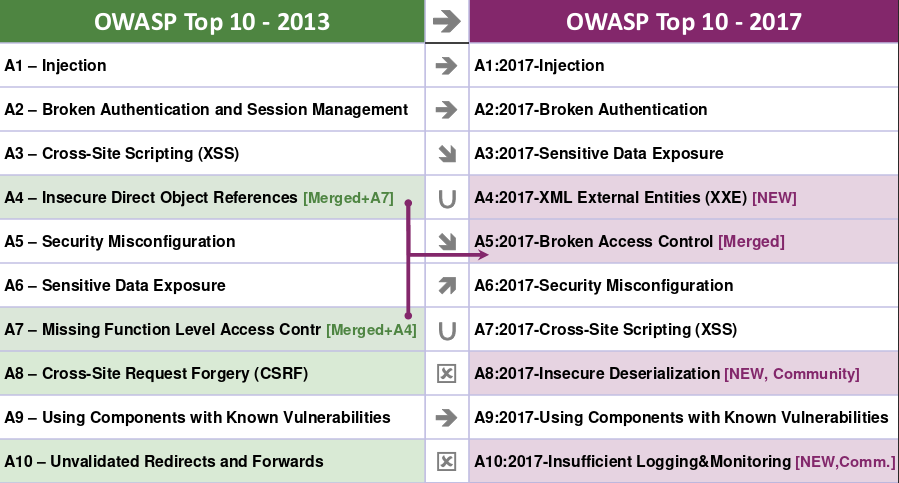

# OWASP TOP 10

Presentation about OWASP Top 10. All the texts from the vulnerabilities were extracted from the official document.

[OWASP TOP 10 DOCUMENT](https://www.owasp.org/images/7/72/OWASP_Top_10-2017_%28en%29.pdf.pdf)

# What's OWASP
OWASP (Open Web Application Security Project) is an organization that provides unbiased and practical, cost-effective information about computer and Internet applications.

# What's OWASP TOP 10
The OWASP Top 10 is a powerful awareness document for web application security. It represents a broad consensus about the most critical security risks to web applications. Project members include a variety of security experts from around the world who have shared their expertise to produce this list.

